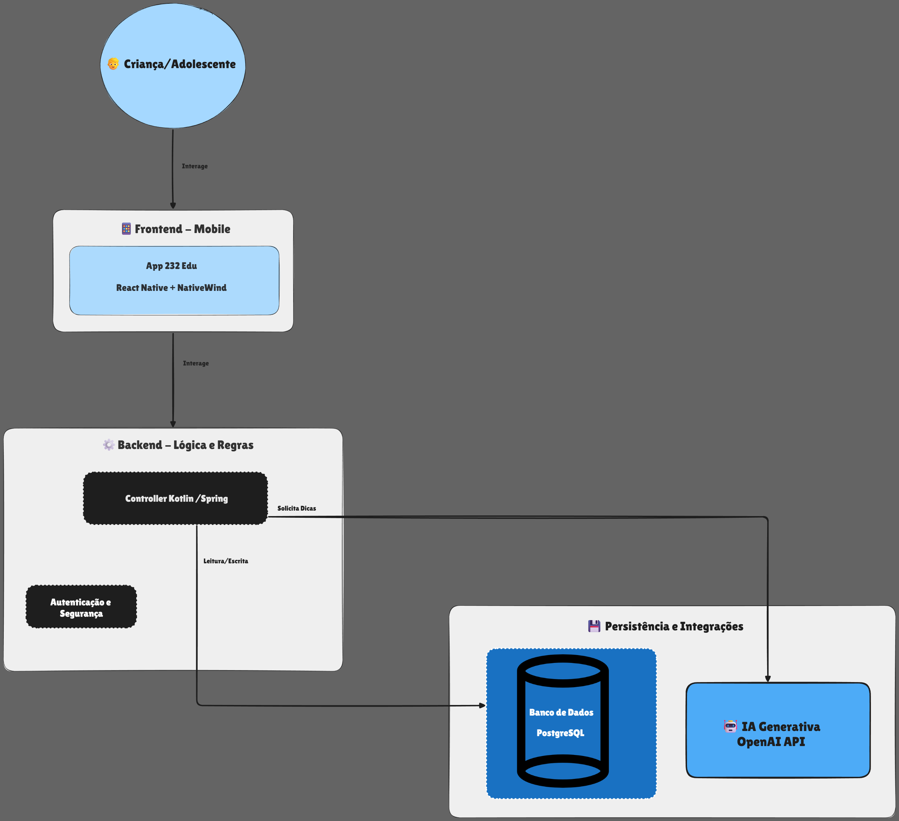
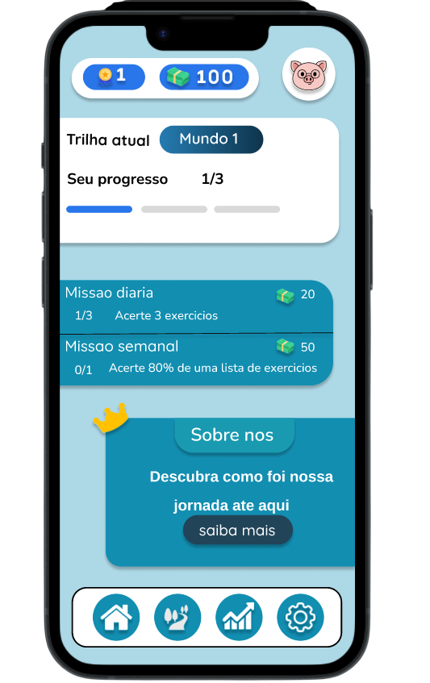
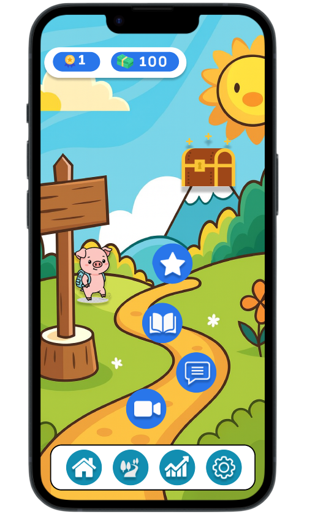
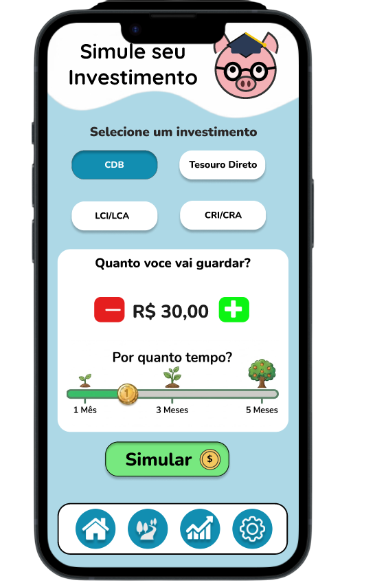
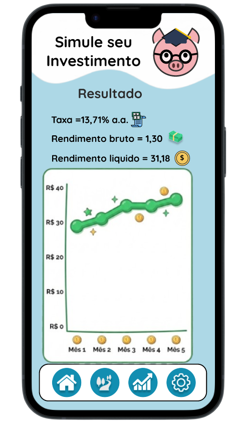

# 232 EDU --- Aplicativo de Educação Financeira Gamificada

------------------------------------------------------------------------

1. Contexto

A educação financeira para crianças e adolescentes ainda é pouco
abordada nas escolas tradicionais, apesar de ser um tema essencial para
o desenvolvimento pessoal e profissional de jovens. Ao mesmo tempo,
dispositivos móveis e aplicativos educativos têm se tornado ferramentas
fundamentais para aprendizado moderno, especialmente quando combinam
elementos de gamificação e interatividade.

O 232 Edu surge como uma solução inovadora, oferecendo uma jornada
de aprendizado divertida, leve e progressiva. Através de trilhas com
vídeos, textos, exercícios, desafios e simulação de investimentos, o app
busca criar hábitos de responsabilidade financeira desde cedo.

------------------------------------------------------------------------

2. Objetivo

Desenvolver um aplicativo educativo gamificado que oriente crianças e
adolescentes sobre conceitos essenciais de educação financeira,
utilizando trilhas progressivas, recompensas, desafios e simulações
reais de investimentos. O objetivo é tornar o aprendizado acessível,
envolvente e significativo.

------------------------------------------------------------------------

3. Arquitetura do Sistema

O diagrama a seguir ilustra o fluxo de dados e a arquitetura geral do sistema,
envolvendo o Frontend Mobile, o Backend de Lógica e Regras, e a camada de
Persistência e Integrações.



------------------------------------------------------------------------

4. Estrutura de Banco de Dados

A seguir, apresentamos a proposta de banco de dados para suportar
trilhas, usuários, progresso, missões e simulações de investimento.

### Diagrama ER (forma textual)

erDiagram

    USERS {
        UUID user_id PK
        VARCHAR name
        VARCHAR email
        VARCHAR password_hash
        INT age
        TIMESTAMP created_at
        TIMESTAMP updated_at
    }

    LEVELS {
        UUID level_id PK
        VARCHAR name
        TEXT description
        INT order_index
        TIMESTAMP created_at
    }

    CONTENT {
        UUID content_id PK
        UUID level_id FK
        VARCHAR type
        TEXT url_or_text
        INT sequence
    }

    EXERCISES {
        UUID exercise_id PK
        UUID level_id FK
        TEXT question
        TEXT correct_answer
    }

    USER_PROGRESS {
        UUID progress_id PK
        UUID user_id FK
        UUID level_id FK
        BOOLEAN completed
        TIMESTAMP completed_at
    }

    MISSIONS {
        UUID mission_id PK
        TEXT description
        INT reward_credits
        BOOLEAN active
    }

    USER_MISSIONS {
        UUID user_mission_id PK
        UUID user_id FK
        UUID mission_id FK
        BOOLEAN completed
        TIMESTAMP completed_at
    }

    INVESTMENT_SIMULATIONS {
        UUID simulation_id PK
        UUID user_id FK
        DECIMAL initial_amount
        DECIMAL monthly_rate
        INT months
        DECIMAL final_amount
        TIMESTAMP created_at
    }

    USERS ||--o{ USER_PROGRESS : tracks
    USERS ||--o{ USER_MISSIONS : completes
    USERS ||--o{ INVESTMENT_SIMULATIONS : performs
    LEVELS ||--o{ CONTENT : contains
    LEVELS ||--o{ EXERCISES : includes

### Descrição das Entidades

**USERS**
Armazena dados dos usuários do aplicativo, incluindo idade e
credenciais.

**LEVELS**
Define os níveis da trilha: Iniciante, Médio e Avançado.

**CONTENT**
Itens da trilha: vídeos, textos e conteúdos educativos.

**EXERCISES**
Questões dos exercícios antes do desafio final.

**USER_PROGRESS**
Acompanhamento da evolução do aluno nas trilhas.

**MISSIONS**
Missões reais que geram créditos (como economizar valor real).

**USER_MISSIONS**
Registra quais missões cada usuário completou.

**INVESTMENT_SIMULATIONS**
Histórico das simulações feitas pelo usuário.

------------------------------------------------------------------------

5. Estrutura de Front-end

O front-end do aplicativo será desenvolvido em React Native, usando
NativeWind para estilização rápida e responsiva.

Tecnologias Principais

-   React Native
-   NativeWind
-   React Navigation
-   Axios
-   Recharts (para gráficos da simulação)

Estrutura de Pastas

src/
├── components/
│ ├── VideoPlayer.tsx
│ ├── TextContent.tsx
│ ├── Quiz.tsx
│ ├── MissionsCard.tsx
│ └── SimulationChart.tsx
├── pages/
│ ├── Login.tsx
│ ├── Home.tsx
│ ├── Levels.tsx
│ ├── LevelContent.tsx
│ ├── Missions.tsx
│ └── Simulation.tsx
├── hooks/
│ ├── useAuth.ts
│ ├── useLevels.ts
│ └── useSimulation.ts
├── services/
│ ├── api.ts
│ ├── userService.ts
│ ├── missionService.ts
│ └── simulationService.ts
└── utils/
├── formatters.ts
└── validations.ts

------------------------------------------------------------------------

6. Fluxos e Imagens Ilustrativas

Esta seção apresenta as telas principais do aplicativo, ilustrando os fluxos de usuário.

### 6.1 Autenticação

As telas de Login e Cadastro são o ponto de entrada do usuário no aplicativo.

| Login | Cadastro |
| :---: | :---: |
|  |  |

### 6.2 Tela Inicial e Trilha de Aprendizado

A tela inicial mostra o progresso e as missões diárias, enquanto a tela de trilha
apresenta o caminho gamificado de aprendizado.

| Tela Inicial (Home) | Trilha de Aprendizado |
| :---: | :---: |
|  |  |

### 6.3 Simulação de Investimentos

O fluxo de simulação permite ao usuário testar diferentes cenários de investimento.

| Simulação - Entrada de Dados | Simulação - Resultado |
| :---: | :---: |
|  |  |

------------------------------------------------------------------------

7. Código de Exemplo

Backend (Kotlin + Spring)

``` kotlin
@PostMapping("/simulate")
fun simulate(@RequestBody request: SimulationRequest): SimulationResponse {
    val finalAmount = request.initial * Math.pow(1 + request.rate, request.months.toDouble())
    return SimulationResponse(finalAmount)
}
```

------------------------------------------------------------------------

8. Considerações de Implementação

Requisitos Técnicos

-   Front-end: React Native\
-   Backend: Kotlin + Spring Boot\
-   Banco: PostgreSQL\
-   Gráficos: Recharts\
-   Autenticação: JWT\
-   Armazenamento de vídeos: S3 ou Firebase Storage

Segurança

-   Senhas com hash\
-   Criptografia em dados sensíveis\
-   Conexões HTTPS\
-   Proteção contra XSS e SQL Injection

KPIs do Projeto

-   Nível médio de conclusão das trilhas\
-   Quantidade de missões realizadas\
-   Total de simulações feitas\
-   Retenção semanal de usuários

------------------------------------------------------------------------

9. Próximos Passos

-   Implementar novos níveis e trilhas\
-   Adicionar novos tipos de investimentos\
-   Criar avatars e itens adicionais\
-   Integrar notificações push

------------------------------------------------------
10. Integrantes

- Sergio Mirabelo 
- [linkedin](https://www.linkedin.com/in/sergio-mirabelo-209bb9366/)
- Pedro Almeida
- [linkedin](https://www.linkedin.com/in/pedro-rodrigues-almeida-63779a227/)
